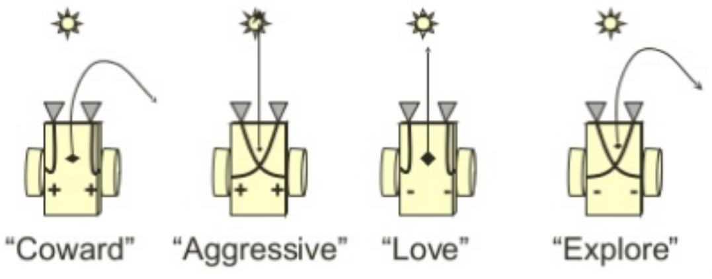
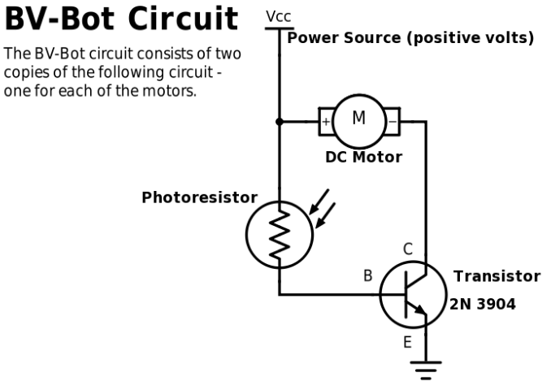

# Breitenberg Vehicle Robot
In this assignment you will build a robotic vehicle that is able to sense the amount of light from a light source in its surroundings and respond to it. The design for this robot was originally proposed by the italian scientist [Valentino Braitenberg](https://en.wikipedia.org/wiki/Valentino_Braitenberg); hence we call it the [Braitenberg Vehicle](https://en.wikipedia.org/wiki/Braitenberg_vehicle) Robot or BV-Bot for short. BV-Bot are simple mobile robots where the motion and behaviour of the robot is directly controlled by sensors (for example photocells), yet the resulting behaviour may appear complex or even intelligent. BV-Bots can exhibit human-like behaviors similar to aggression and attraction. BV-Bots are unique in that the source of its behaviour is inherent in its electronic circuitry without the need for programing it showing that complex behaviours do not require complex mechanical or electronic system.

## BV Bot Behaviour
The BV-Bot is a simple robot. It shows that by simply reacting to what is sensed from the environment, a robot can demonstrate behavior that appears intelligent. The BV-Bot consists of two light sensors on the front and two small motors on the sides. Each motor has a wheel on its shaft. With its two light sensors, BV-Bots measure the amount of light from a light source in its surrounding. Depending on how the sensors are connected to the motors the robot exhibits different types of behaviours. Here is a video introducing the concept of BV-Bots (https://youtu.be/A-fxij3zM7g) and and here is a Scratch simulation (https://scratch.mit.edu/projects/19542889/) allowing you to explore the different types of behaviours they are capable of.

The left and right light sensors generate voltages that are proportional to the amount of light they receive. The output voltage of each sensor is amplified and is applied to each of the two motors on the left and right sides of the robot. The left and right sensors’ output can be connected straight to the left and right motors, respectively, or in a crossed form. Depending how the sensors are connected to the motors, the robot will show different behaviors and will either be attracted to the light source or turn away from it.

## Circuit

### Circuit Criteria
* As you are building the circuit keep the design of your chassi in mind, e.g. a large breadboard will need a larger chassi, what is the best location for the photoresistors on the breadboard, etc.
* Use best breadboarding practices. Keep wiring snug to the board (no big loops) to avoid wires getting snagged.
* Minimize the amount of wiring - every wire is a potential point of failure.
* Build your circuit compact and robust. 
* Make sure the hookup wires going from the motors and to the breadboard are long enough to allow you to position the motors correctly in the chassi.
* Place your light sensors "smartly" to optimize their performance. Consider using a baffle between the light sensors.
* Robot circuit needs to be easily accessible for inspection and modification.
* Robot has to include an supplementary circuit "doing something else" other than controlling the robot (e.g. blinking LEDs, etc).

## Chassi
The chassi for the robot has to be well-designed and it needs to make good use of the approved materials. The design also needs to be innovative and needs to work properly with the robot circuit and the mechanical (moving) parts. You will be provided with one hardboard and one castor wheel for our chassi. In addition you can also use the following materials:

* cardboard
* salvaged parts from the teardown project
* paper rolls (from toilet paper or paper tissues)
* boxes (e.g. from tissue)
* styrofoam
* lids from milk jugs and jars
* food containers (cans, tins, cups, etc)
* tupperware
* rubber bands
* string, glue, tape
* wood/lumber
* 3D printed parts

Do **not** use the following materials:
* glass
* Building kits (e.g. LEGO, etc)
* Prebuild vehicles or vehicle parts (toy cars, wheels etc)

### Chassi Criteria
* The chassi of the robot needs to be sturdy and reinforced properly, particularly if you are using cardboard. Having bumpers is a good idea as your robot might be bumping into things.
* Be mindful of the center of gravity. If your breadboard and motors are placed all the way to the front of the robot there is a risk that the robot might end up being front heavy and have a tendency to tip over.
* You need a minimum of two wheels + a third contact point with the ground. 
* Your robot will be marked on attractiveness and innovative design (it has to be neat-looking, use colors and decorate it).
* During construction and testing the robot will be powered by your battery pack. 

# Rubric
**Evidence of Progress & Effort**
Class time has been used efficiently. On task focused work most of the time. Demonstrate team working skills.

**Positive attitude and behaviours**
Active and engaged participation and problem solving. Efficient and organized management of information and materials. Evidence of effort to learn the material and do the assignment independently (not copying someone else’s assignment or having another person do the assignment).

**BV-Bot circuit**
Robust and well-designed and works as intended. Robot runs as intended using the default circuit and it is evident that student is able troubleshoot and fix "behavioural issues" (in the robot). Light attraction circuit. Student is able to rewire their robot to exhibit attraction avoidance. Additional functionality has been incorporated.

**Chassi Construction**
Well-designed, good use of materials, innovative and evidence that thought has gone into designing and building the chassi. Works as intended.

**Appearance**
Robot is attractive, has a unified and consistent look.

**Knowledge**
Ability to answer questions and provide logical and complete explanations of robot hardware. Ability to troubleshoot issues.
